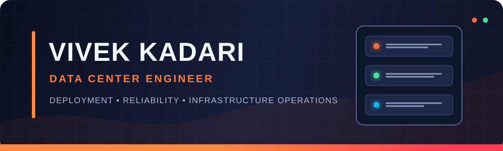

<div align="center">
  
</div>

<div align="center">

[](#certification--education)
[](#connect)
[](#technical-arsenal)

</div>

## I keep critical infrastructure running.

Data Center Engineer with **2+ years of hands-on enterprise experience** deploying, troubleshooting, migrating, and maintaining the physical systems behind always-on services. I work where hardware, networks, power, cabling, process, and uptime meet.

```text
DEPLOY  →  VALIDATE  →  TROUBLESHOOT  →  DOCUMENT  →  IMPROVE
```

### Impact at a glance

| 99.5% | 20% faster | 30% fewer | Zero |
|:---:|:---:|:---:|:---:|
| Service availability supported | Deployment cycles | Cable-related incidents | Safety incidents |

## Technical arsenal

<table>
<tr>
<td width="50%" valign="top">

### ⚡ Data Center Operations

- Rack & stack and rack integration
- Server and storage deployment
- Asset lifecycle and inventory control
- Remote hands and vendor coordination
- Capacity, power, and rack elevation reviews
- Decommissioning and migration support

</td>
<td width="50%" valign="top">

### 🌐 Network Infrastructure

- Cisco Nexus and Catalyst
- Juniper and Arista switching
- TCP/IP, DNS, DHCP, and VLANs
- Routing and switching fundamentals
- Firmware upgrades and link validation
- Incident response and root-cause analysis

</td>
</tr>
<tr>
<td width="50%" valign="top">

### 🖥️ Enterprise Hardware

- Dell PowerEdge and HPE ProLiant
- Cisco UCS and Lenovo ThinkSystem
- Enterprise storage systems
- SSD, HDD, memory, PSU, NIC, and fan replacement
- Hardware diagnostics and preventive maintenance
- Windows Server, Linux, and VMware ESXi

</td>
<td width="50%" valign="top">

### 🔌 Structured Cabling

- Single-mode and multi-mode fiber
- Copper cabling and patch panels
- OTDR testing and link verification
- Cable tracing and fault isolation
- Color-coded labeling and pathway organization
- CMDB and cabling documentation

</td>
</tr>
</table>

## Mission highlights

### 🟠 Production Infrastructure — Charter Communications

Deploy and maintain enterprise servers, storage, Cisco Nexus, and Juniper equipment in production environments. Execute component-level diagnostics, structured cabling, firmware upgrades, infrastructure migrations, capacity monitoring, and remote-hands operations while protecting availability.

### 🔵 Enterprise Data Center — Williams Sonoma

Deployed Dell PowerEdge servers, Catalyst switches, storage arrays, fiber, and patching infrastructure. Supported provisioning and MDT imaging, restored affected systems within an average of two hours, improved cable-management standards, and maintained accurate lifecycle documentation.

## Featured professional projects

<table>
<tr>
<td width="50%" valign="top">

### 🚚 Infrastructure Migration Playbook

A vendor-neutral execution framework for relocating production equipment while protecting service continuity, asset integrity, and change-control compliance.

**Covers:** discovery, dependency mapping, rack and power validation, migration sequencing, rollback readiness, post-move testing, and CMDB closeout.

[**Explore the migration playbook →**](./projects/infrastructure-migration-playbook/README.md)

</td>
<td width="50%" valign="top">

### 🔌 Cabling Standardization Program

A repeatable operating standard for improving physical-layer traceability, safety, troubleshooting speed, and audit readiness across enterprise racks.

**Covers:** fiber and copper handling, labeling, pathway organization, link testing, quality gates, documentation, and reusable audit controls.

[**Explore the cabling program →**](./projects/cabling-standardization-program/README.md)

</td>
</tr>
</table>

> These case studies are intentionally vendor-neutral and exclude confidential infrastructure details.

### Additional programs

| Program | Mission | Operational value |
|---|---|---|
| **Data Center Expansion** | Deployed server and network infrastructure across production environments | Increased infrastructure capacity |
| **Hardware Refresh** | Coordinated replacement of aging infrastructure components | Improved reliability and performance |

## Tools of the trade


## Certification & education

- **Cisco Certified Network Associate (CCNA)** — Enterprise networking, IP connectivity, security fundamentals, and automation
- **M.S. in Advanced Data Analytics** — University of North Texas
- **B.Tech. in Mechanical Engineering** — Kakatiya Institute of Technology and Science

## Building next

- Infrastructure automation for repeatable operations
- Linux administration and network reliability
- Reusable runbooks that reduce time to resolution
- Operational analytics for capacity and lifecycle planning

## Connect

I'm based in **Denver, Colorado** and interested in connecting with teams building reliable, scalable data center infrastructure.

<div align="center">

### Ready to deploy. Driven to improve. Built for uptime.


</div>
